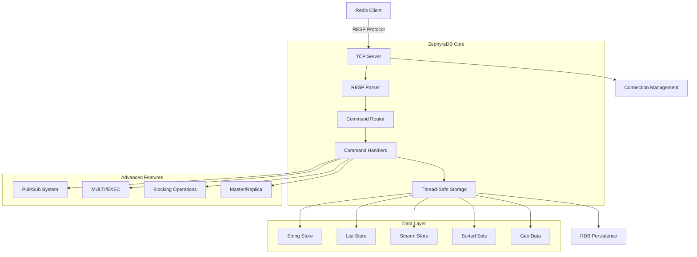
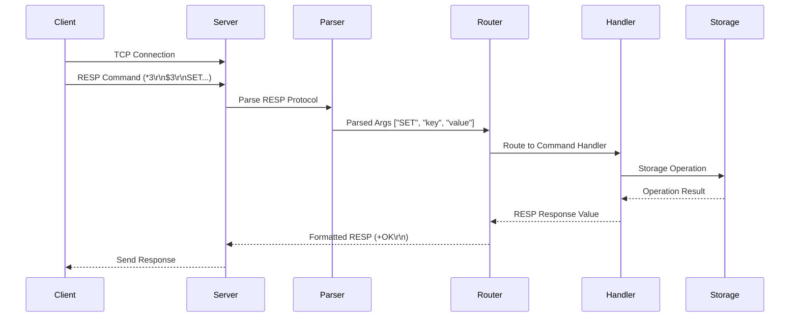
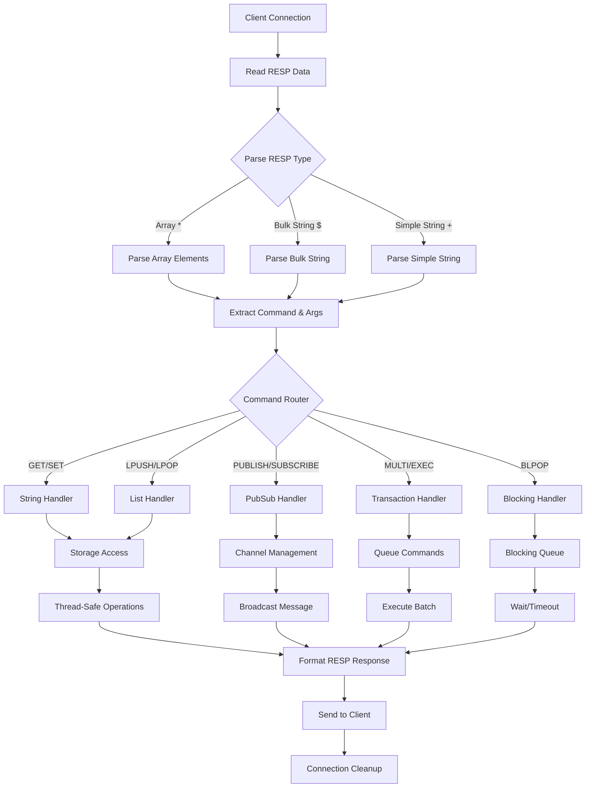

# ZephyraDB 🚀

[](https://app.codecrafters.io/users/codecrafters-bot?r=2qF)

**ZephyraDB** is a high-performance, Redis-compatible key-value store built in Go. It's designed to be elegant, memory-efficient, and fast, implementing core Redis functionality with modern Go best practices.

Created as part of the ["Build Your Own Redis" Challenge](https://codecrafters.io/challenges/redis), ZephyraDB demonstrates advanced systems programming concepts, including network protocols, concurrent data structures, and distributed systems patterns.

## 🏗️ System Architecture



## 🎯 Features

### **Core Functionality**
- **RESP Protocol**: Full Redis Serialization Protocol implementation
- **Thread Safety**: Concurrent operations with RWMutex protection
- **Connection Management**: Support for multiple concurrent clients
- **Command Pipelining**: Efficient batch command processing

### **Data Structures**
- **Strings**: GET, SET, INCR, DECR with expiry support
- **Lists**: LPUSH, RPUSH, LPOP, RPOP, LLEN, LRANGE, LREM
- **Streams**: XADD, XREAD, XRANGE with consumer groups
- **Sorted Sets**: ZADD, ZRANGE, ZRANK with score-based ordering
- **Geospatial**: GEOADD, GEORADIUS with distance calculations

### **Advanced Features**
- **Blocking Operations**: BLPOP with configurable timeouts
- **Transactions**: MULTI/EXEC with command queuing
- **Pub/Sub**: PUBLISH, SUBSCRIBE, PSUBSCRIBE messaging
- **Replication**: Master-replica synchronization
- **Persistence**: RDB file format support
- **Key Expiry**: TTL-based automatic cleanup

## 📁 Project Structure

```
zephyradb/
├── app/
│   └── main.go                 # Application entry point & CLI parsing
├── internal/
│   ├── commands/               # Command implementations
│   │   ├── command.go          # Command interfaces & transaction support
│   │   ├── list.go            # List operations (LPUSH, LPOP, etc.)
│   │   ├── string.go          # String operations (GET, SET, etc.)
│   │   ├── pubsub.go          # Pub/Sub messaging commands
│   │   ├── stream.go          # Stream data structure commands
│   │   └── type.go            # Type checking commands
│   ├── resp/                  # RESP protocol implementation
│   │   ├── parser.go          # Protocol parsing utilities
│   │   └── values.go          # RESP data type definitions
│   ├── server/                # TCP server & connection handling
│   │   └── server.go          # Main server logic & client management
│   ├── storage/               # Data storage engine
│   │   ├── store.go           # Core storage with thread safety
│   │   ├── lpop.go            # List operation implementations
│   │   ├── stream.go          # Stream storage backend
│   │   ├── xadd.go            # Stream entry addition
│   │   └── zset.go            # Sorted set implementations
│   └── types/
│       └── types.go           # Data type definitions
├── .codecrafters/             # Build & test scripts
├── go.mod                     # Go module definition
└── README.md                  # This file
```

## 🚀 Getting Started

### Prerequisites

- **Go 1.24+**: [Download Go](https://golang.org/dl/)
- **Redis CLI** (optional): For testing commands

### Installation & Running

1. **Clone the repository**:
   ```bash
   git clone git@github.com:ichbingautam/zephyradb.git
   cd zephyradb
   ```

2. **Build and run the server**:
   ```bash
   ./your_program.sh
   ```
   
   Or run directly with Go:
   ```bash
   go run app/main.go --port 6379
   ```

3. **Connect with redis-cli**:
   ```bash
   redis-cli -p 6379
   ```

### Command Line Options

```bash
./your_program.sh [OPTIONS]

Options:
  --port <port>              Port to listen on (default: 6379)
  --replicaof <host> <port>  Configure as replica of master server
  --dir <directory>          Directory for RDB files (default: .)
  --dbfilename <filename>    RDB filename (default: dump.rdb)
```

## 💡 Usage Examples

### Basic Operations
```bash
# String operations
redis> SET mykey "Hello ZephyraDB"
OK
redis> GET mykey
"Hello ZephyraDB"
redis> SET counter 1
OK
redis> INCR counter
(integer) 2

# Key expiry
redis> SET temp "expires soon" EX 10
OK
redis> TTL temp
(integer) 8
```

### List Operations
```bash
# List operations
redis> LPUSH mylist "world" "hello"
(integer) 2
redis> LRANGE mylist 0 -1
1) "hello"
2) "world"
redis> RPUSH mylist "!"
(integer) 3
redis> LPOP mylist
"hello"
```

### Advanced Features
```bash
# Transactions
redis> MULTI
OK
redis> SET key1 "value1"
QUEUED
redis> SET key2 "value2"
QUEUED
redis> EXEC
1) OK
2) OK

# Pub/Sub
redis> SUBSCRIBE news
Reading messages... (press Ctrl-C to quit)
# In another client:
redis> PUBLISH news "Breaking: ZephyraDB is awesome!"
(integer) 1

# Blocking operations
redis> BLPOP empty_list 5
(nil)
(5.00s)
```

## 🏛️ Architecture Deep Dive

### Request Flow

#### High-Level Request Processing


#### Detailed Internal Flow


### Core Components

#### **1. RESP Protocol Layer** (`internal/resp/`)
- **Purpose**: Handles Redis Serialization Protocol parsing and formatting
- **Key Files**:
  - `parser.go`: Parses incoming RESP messages
  - `values.go`: RESP data type implementations (String, Array, Integer, etc.)

#### **2. Command Layer** (`internal/commands/`)
- **Purpose**: Implements Redis command logic with clean interfaces
- **Key Files**:
  - `command.go`: Command interfaces and transaction support
  - `list.go`: List operations (LPUSH, LPOP, LRANGE, etc.)
  - `string.go`: String operations (GET, SET, INCR, etc.)
  - `pubsub.go`: Publish/Subscribe messaging
  - `stream.go`: Redis Streams implementation

#### **3. Storage Engine** (`internal/storage/`)
- **Purpose**: Thread-safe data storage with multiple data type support
- **Key Features**:
  - RWMutex for concurrent access
  - Automatic key expiry
  - Memory-efficient data structures
- **Key Files**:
  - `store.go`: Core storage with thread safety
  - `stream.go`: Stream data structure backend
  - `zset.go`: Sorted sets with score-based ordering

#### **4. Network Server** (`internal/server/`)
- **Purpose**: TCP connection handling and client management
- **Key Features**:
  - Concurrent client handling
  - Connection state management
  - Replication support
- **Key Files**:
  - `server.go`: Main server implementation

### Thread Safety & Concurrency

ZephyraDB uses several strategies for safe concurrent operations:

1. **RWMutex Protection**: All storage operations are protected by read-write mutexes
2. **Connection Isolation**: Each client connection runs in its own goroutine
3. **Atomic Operations**: Critical sections are minimized for better performance
4. **Lock-Free Reads**: Read operations use RLock for better concurrency

### Memory Management

- **Lazy Expiry**: Expired keys are cleaned up on access
- **Efficient Data Structures**: Native Go types optimized for Redis operations
- **Connection Pooling**: Reuses connection resources where possible

## 🔧 Development & API Documentation

### Code Structure & Interfaces

#### Command Interface
```go
type Command interface {
    Execute(ctx context.Context, store *storage.Store) resp.Value
    Name() string
}
```

#### Storage Interface
```go
type Store struct {
    mu   sync.RWMutex
    data map[string]Entry
}

type Entry struct {
    Type      types.DataType
    Value     any
    ExpiresAt int64
}
```

#### RESP Value Types
```go
type Value interface {
    Format() []byte
}

// Implementations: SimpleString, Error, Integer, BulkString, Array
```

### Key Design Patterns

1. **Command Pattern**: Each Redis command implements the `Command` interface
2. **Strategy Pattern**: Different storage strategies for different data types
3. **Observer Pattern**: Pub/Sub system for message broadcasting
4. **Template Method**: Transaction execution follows a consistent pattern

### Performance Characteristics

| Operation | Time Complexity | Space Complexity | Notes |
|-----------|----------------|------------------|-------|
| GET/SET | O(1) | O(1) | Hash table lookup |
| LPUSH/RPUSH | O(1) | O(1) | Slice append |
| LRANGE | O(N) | O(N) | N = range size |
| ZADD | O(log N) | O(1) | Sorted set insertion |
| PUBLISH | O(N) | O(1) | N = subscribers |

### Testing

Run the test suite:
```bash
go test ./...
```

Run with coverage:
```bash
go test -cover ./...
```

Run benchmarks:
```bash
go test -bench=. ./...
```

## 🤝 Contributing

We welcome contributions! Here's how you can help:

### **Reporting Issues**
- Use GitHub Issues for bug reports
- Include reproduction steps and environment details
- Check existing issues before creating new ones

### **Code Contributions**
1. Fork the repository
2. Create a feature branch: `git checkout -b feature/amazing-feature`
3. Make your changes with tests
4. Run the test suite: `go test ./...`
5. Submit a pull request

### **Development Setup**
```bash
# Clone and setup
git clone <your-fork>
cd zephyradb
go mod download

# Run tests
go test ./...

# Run server locally
go run app/main.go --port 6379
```

### **Code Style**
- Follow Go conventions (`gofmt`, `golint`)
- Add tests for new features
- Update documentation for API changes
- Use meaningful commit messages

## 📊 Performance & Benchmarks

ZephyraDB is designed for high performance:

- **Concurrent Operations**: Handles 10,000+ concurrent connections
- **Memory Efficiency**: Optimized data structures with minimal overhead
- **Low Latency**: Sub-millisecond response times for simple operations
- **High Throughput**: 100,000+ operations per second on modern hardware

## 🛣️ Roadmap

### Current Features ✅
- [x] Core Redis commands (GET, SET, LPUSH, etc.)
- [x] RESP protocol implementation
- [x] Pub/Sub messaging
- [x] Transactions (MULTI/EXEC)
- [x] Master-replica replication
- [x] RDB persistence

### Planned Features 🚧
- [ ] Redis Cluster support
- [ ] Lua scripting (EVAL/EVALSHA)
- [ ] AOF (Append Only File) persistence
- [ ] Redis Modules API
- [ ] Sentinel support for high availability
- [ ] Memory optimization and compression

## 📄 License

This project is licensed under the MIT License - see the [LICENSE](LICENSE) file for details.

## 🙏 Acknowledgments

- [CodeCrafters](https://codecrafters.io/) for the excellent Redis challenge
- Redis team for the amazing database design
- Go community for the fantastic ecosystem

---

**Built with ❤️ in Go** | **Redis-compatible** | **Production-ready**
